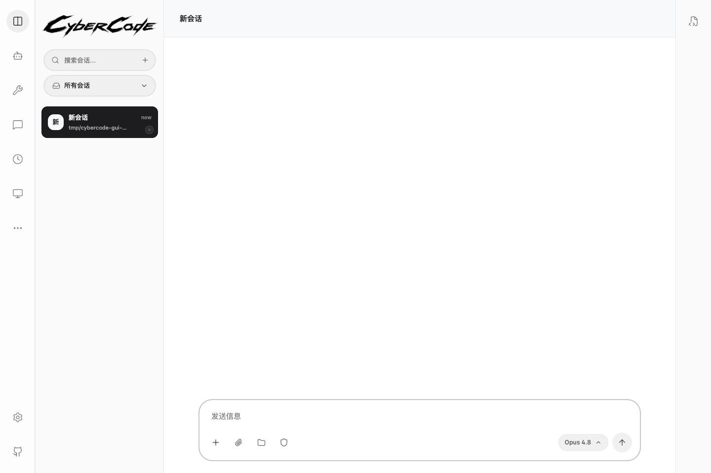

# CyberCode

   
  <picture>
    <source media="(prefers-color-scheme: dark)" srcset="docs/images/cybercode-wordmark-dark.png">
    
  </picture>

  <a href="README.zh-CN.md">简体中文</a> ·
  <strong>English</strong> ·
  <a href="README.ja.md">日本語</a> ·
  <a href="README.ko.md">한국어</a>

  <strong>User Guide: <a href="https://wk42worldworld.github.io/cybercode/">https://wk42worldworld.github.io/cybercode/</a></strong> 
  <a href="https://github.com/wk42worldworld/cybercode/releases/latest">Download Desktop</a> ·
  <a href="https://github.com/wk42worldworld/cybercode/stargazers">Star CyberCode</a> ·
  <a href="https://github.com/wk42worldworld/cybercode/issues">Issues</a>

CyberCode combines a **Claude Code-style coding workflow** with **Hermes-style self-evolution**, persistent memory, native token optimization, flexible model providers, a cross-platform desktop app, and a terminal TUI.

> A coding agent that remembers your habits, learns reusable ways of working, and spends less context solving the next task.

## Why CyberCode

| Common limitation | CyberCode's approach |
|---|---|
| A new conversation starts from zero | Long-term user and project memory carries useful context across sessions |
| The agent behaves the same no matter how long you use it | Self-evolution turns repeated preferences and successful workflows into memory and reusable Skills |
| Large files and noisy tool output consume context quickly | Code Graph, RTK, smart pruning, Lite cleanup, concise responses, and reuse-first coding reduce avoidable tokens |
| The product is tied to one interface | Use the same agent core through the desktop app, terminal TUI, Telegram, or Feishu |
| Switching model vendors requires extra proxy setup | A built-in protocol bridge supports Anthropic- and OpenAI-compatible providers |
| Core behavior is difficult to inspect or customize | The client, server, desktop app, adapters, memory, and optimization stack are open source |

## Self-Evolution, Not Just Memory

CyberCode does more than store chat history. It extracts stable preferences, keeps project knowledge available across sessions, and can turn repeated solutions into reusable skill candidates. Learning records remain visible and editable, so improvement stays under the user's control.

## Native Token Optimization

CyberCode reduces context waste at several layers:

- **Code Graph** understands symbols and relationships before the agent reads whole files.
- **RTK** compresses Git, test, build, terminal, and Docker output.
- **Smart Pruning** removes stale duplicate tool output from model requests while preserving the local transcript.
- **Lite, Caveman, and Lazy Programmer** remove prompt noise, response filler, unnecessary dependencies, and repeated implementation work.

Each optimizer has an independent global switch in the desktop app, together with a combined estimated savings range and Code Graph visualization.

## One Agent, More Freedom

- Desktop GUI and terminal TUI share the same local agent core and provider settings.
- Anthropic, OpenAI, Google, DeepSeek, Kimi, MiniMax, GLM, OpenRouter, and compatible local endpoints can be configured without a separate LiteLLM proxy.
- Telegram and Feishu provide remote conversations and permission approval.
- Scheduled tasks, MCP, Skills, plugins, Agent Teams, Worktrees, and Computer Use are built into the same project.

  

## Start Here

- **Use and install CyberCode:** [Official User Guide](https://wk42worldworld.github.io/cybercode/)
- **Download macOS, Windows, and Linux builds:** [Latest Release](https://github.com/wk42worldworld/cybercode/releases/latest)
- **Contribute:** [CONTRIBUTING.md](CONTRIBUTING.md)

## License

[MIT](LICENSE)
