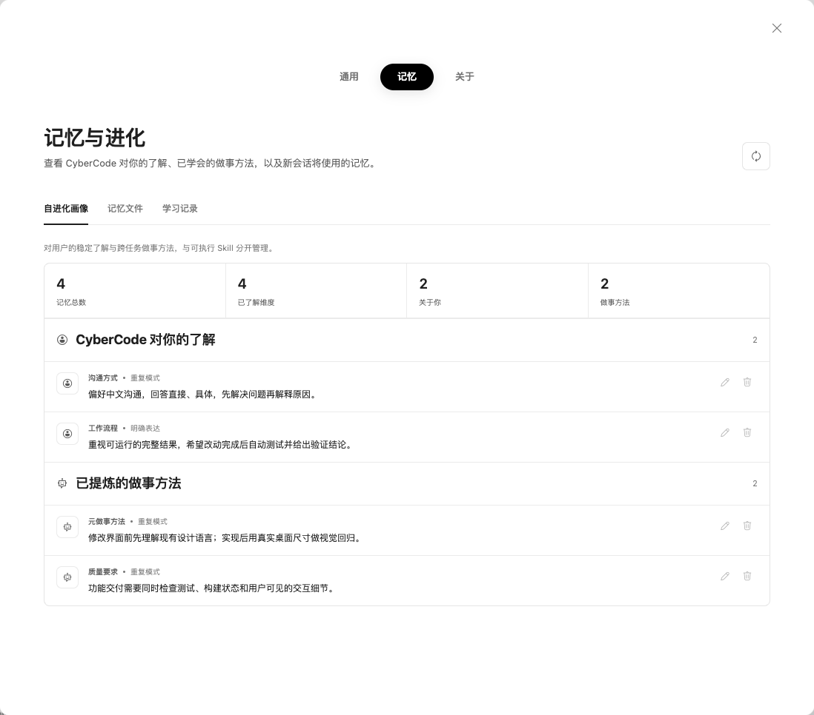
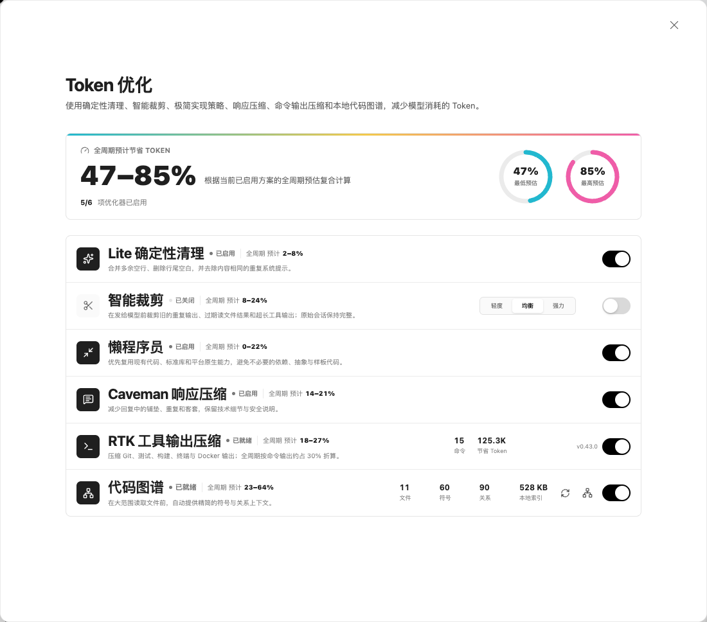
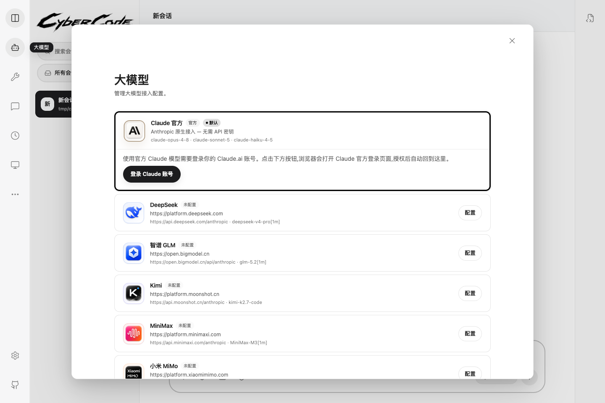
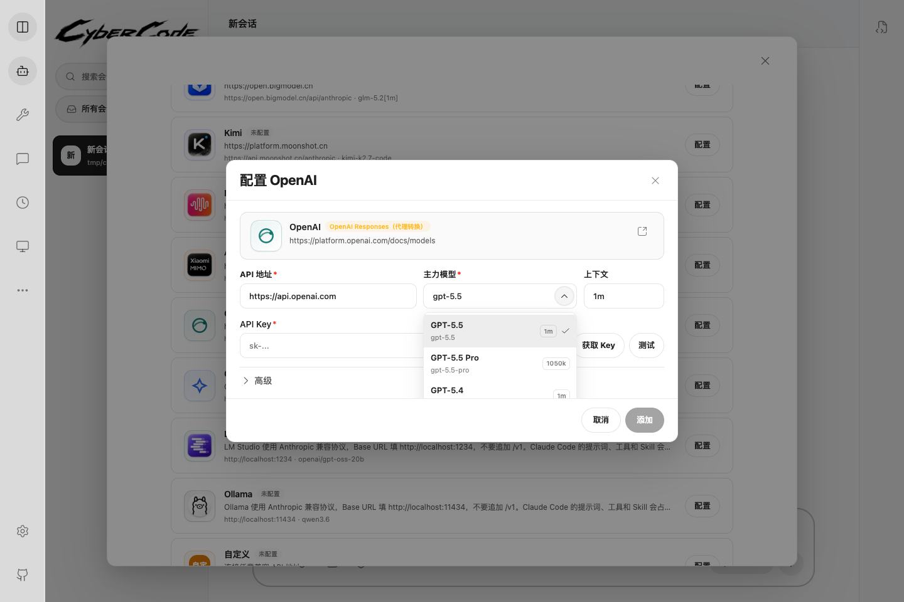
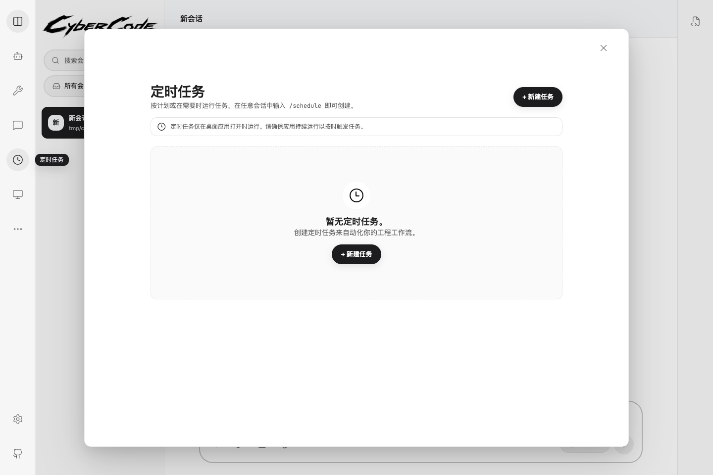

# CyberCode

<p align="center">
  <br>
  <picture>
    <source media="(prefers-color-scheme: dark)" srcset="docs/images/cybercode-wordmark-dark.png">
    
  </picture>
</p>

<p align="center">
  <strong>English</strong> ·
  <a href="README.zh-CN.md">简体中文</a> ·
  <a href="README.ja.md">日本語</a> ·
  <a href="README.ko.md">한국어</a>
</p>

<div align="center">

[](https://github.com/wk42worldworld/cybercode/stargazers)
[](https://github.com/wk42worldworld/cybercode/releases/latest)
[](https://wk42worldworld.github.io/cybercode/en/)
[](LICENSE)

</div>

<p align="center">
  <strong>Your AI programming partner, built to fight alongside you.</strong><br>
  A local, open-source coding agent with a Claude Code-style workflow, persistent memory, Hermes-inspired self-evolution, native token optimization, flexible model providers, and both desktop and terminal interfaces.
</p>

<p align="center">
  <a href="https://github.com/wk42worldworld/cybercode/releases/latest"><strong>Download Desktop</strong></a> ·
  <a href="https://wk42worldworld.github.io/cybercode/en/"><strong>User Guide</strong></a> ·
  <a href="#install-the-cli"><strong>Install CLI</strong></a> ·
  <a href="#why-cybercode"><strong>Why CyberCode</strong></a>
</p>

CyberCode is designed for people who want the power of a terminal coding agent without giving up provider choice, a polished desktop workflow, long-term continuity, or control over context cost. The desktop app, TUI, local server, memory system, provider bridge, adapters, and optimization stack all live in this repository.

## Install the CLI

### macOS / Linux

```bash
curl -fsSL https://raw.githubusercontent.com/wk42worldworld/cybercode/main/scripts/install-cli.sh | bash
```

### Windows PowerShell

```powershell
irm https://raw.githubusercontent.com/wk42worldworld/cybercode/main/scripts/install-cli.ps1 | iex
```

Then open any project and start the agent:

```bash
cybercode
```

The installer fetches the latest stable CLI, installs Bun when needed, adds `cybercode` to the current user's PATH, and preserves an existing CLI configuration during updates. For the graphical app, download the latest build for macOS, Windows, or Linux from [GitHub Releases](https://github.com/wk42worldworld/cybercode/releases/latest).

## Why CyberCode

### It gets better at working with you

CyberCode does more than restore chat history. Its memory system extracts stable communication preferences, collaboration habits, project knowledge, and reusable ways of working. Repeated successful approaches can become skill candidates, giving later sessions a better starting point instead of making every conversation begin from zero.

Memory is not a hidden black box. The desktop app shows what CyberCode believes it has learned, where the insight came from, and which methods it has distilled. You can edit or delete individual entries, inspect learning records, and maintain the underlying memory files yourself.

<p align="center">
  
</p>

### It treats context as a resource

Large repositories, verbose command output, repeated system prompts, and stale tool results can consume a model's context before the real work is finished. CyberCode provides several independent optimization layers, each with its own global switch:

- **Lite cleanup** removes deterministic prompt noise such as duplicate instructions, trailing spaces, and redundant blank lines.
- **Smart pruning** trims stale, low-value context while preserving the local transcript.
- **Lazy Programmer** favors reuse, standard libraries, and focused implementations over unnecessary code and dependencies.
- **Caveman** compresses repetitive assistant responses while preserving conclusions, evidence, and safety information.
- **RTK** compresses Git, test, build, terminal, and Docker output before it reaches the model.
- **Code Graph** supplies symbol and relationship context before the agent reads entire files.

The panel reports which layers are active and presents a combined estimated savings range. Estimates are clearly labeled rather than presented as guaranteed billing reductions.

<p align="center">
  
</p>

### It understands repository structure before reading everything

The local Code Graph indexes files, symbols, references, and relationships. The agent can use that structure to locate the right implementation, follow dependencies, and prepare a compact architecture preflight before opening large amounts of source code. This is especially useful for unfamiliar repositories, impact analysis, and cross-file refactoring.

The desktop visualization makes the same index inspectable: search symbols, switch between architecture and file views, zoom into modules, and rebuild the project index when needed.

<p align="center">
  
</p>

### It keeps model choice separate from the product experience

CyberCode supports the official Claude path, Anthropic-compatible endpoints, OpenAI-compatible providers, and local or custom endpoints through one provider layer. Built-in presets cover common services such as OpenAI, Google, DeepSeek, Kimi, MiniMax, GLM, OpenRouter, and local runtimes, while custom model names and context-window metadata remain configurable.

The agent also includes a provider-neutral local WebSearch fallback. Models without reliable native browsing can still use live search results, domain filters, caching, and a direct GitHub Trending fetch path instead of silently falling back to stale model knowledge.

<table>
  <tr>
    <td width="50%"><br><b>Provider control in the app</b><br>Configure hosted or local endpoints, test connections, and choose defaults without leaving the desktop workflow.</td>
    <td width="50%"><br><b>Model choice per session</b><br>Select a known model or enter a custom model identifier while keeping the same agent tools and interface.</td>
  </tr>
</table>

### It is one agent across desktop, terminal, and remote channels

The React + Tauri desktop app and Ink terminal interface share the same local agent core. A session can use file attachments, slash commands, permissions, MCP tools, Skills, plugins, background agents, Agent Teams, Git worktrees, Computer Use, and headless output without turning each surface into a separate product.

Telegram and Feishu adapters can relay conversations and permission requests when you are away from the machine. Scheduled tasks add one-time or recurring local jobs, so repository maintenance and routine checks do not have to wait for a manually opened chat.

<p align="center">
  
</p>

### It remains inspectable and portable

CyberCode keeps the product stack open: client, server, desktop shell, adapters, memory, search, provider integration, and optimization logic. Agent data migration tools can inspect compatible Skills, memory, rules, and project data from other local agents before importing, making it easier to change tools without discarding accumulated workflows.

## Capability Map

| Area | What is included |
|---|---|
| Coding workflow | File editing, terminal tools, project search, permission modes, slash commands, attachments, rewind, branching, and session resume |
| Agent intelligence | Persistent memory, self-evolution review, reusable Skills, sub-agents, Agent Teams, background tasks, and worktrees |
| Context efficiency | Dynamic context-window awareness, automatic compression, Lite cleanup, smart pruning, Lazy Programmer, Caveman, RTK, and Code Graph |
| Model access | Official Claude login, Anthropic-compatible APIs, OpenAI-compatible providers, local endpoints, custom models, and per-model context metadata |
| Web and tools | Provider-neutral WebSearch fallback, WebFetch, MCP servers, plugins, Computer Use, and environment-aware tool availability |
| Interfaces | Cross-platform desktop app, terminal TUI, `--print` headless mode, Telegram, and Feishu |
| Automation | One-time and recurring scheduled tasks, remote approval, background agents, and machine-readable JSON output |
| Portability | Agent data migration, editable local memory, open adapters, and an open-source local server |

## Common CLI Commands

| Command | Purpose |
|---|---|
| `cybercode` | Start an interactive agent in the current project |
| `cybercode "explain this repository"` | Start with an initial task |
| `cybercode -p "fix the failing tests"` | Print the result and exit for scripts or CI |
| `cybercode -c` | Continue the latest session in the current project |
| `cybercode -r` | Choose and resume a saved session |
| `cybercode --model <model>` | Select a model for the current session |
| `cybercode --permission-mode plan` | Start in planning mode |
| `cybercode -w feature-name` | Create an isolated Git worktree |
| `cybercode mcp --help` | Configure MCP servers |
| `cybercode plugin --help` | Install and manage plugins |
| `cybercode doctor` | Diagnose the local environment |

The desktop composer also supports slash commands for session control, memory, models, scheduling, teams, tasks, context inspection, and tool management. See the [complete slash-command reference](https://wk42worldworld.github.io/cybercode/en/guide/slash-commands).

## Start Here

- [Desktop download](https://github.com/wk42worldworld/cybercode/releases/latest)
- [English user guide](https://wk42worldworld.github.io/cybercode/en/)
- [CLI quick start](https://wk42worldworld.github.io/cybercode/en/guide/quick-start)
- [Third-party model setup](https://wk42worldworld.github.io/cybercode/en/guide/third-party-models)
- [Memory system](https://wk42worldworld.github.io/cybercode/en/memory/)
- [Agent framework](https://wk42worldworld.github.io/cybercode/en/agent/)
- [Contributing](CONTRIBUTING.md)
- [Roadmap](ROADMAP.md)

## License

[MIT](LICENSE)
