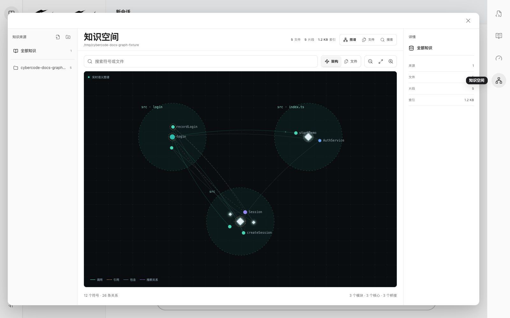

# Knowledge Space and Code Graph

CyberCode puts project structure and user-managed local references in one Knowledge Space. Click the graph icon in the desktop rail to open it directly; there is no need to open Token Optimization first.

## Two indexes with different jobs

### Code Graph

- **Indexes:** files, classes, functions, methods, references, calls, and containment relationships.
- **Purpose:** implementation discovery, architecture, impact analysis, and cross-file refactoring.
- **Model use:** eligible coding tasks receive an automatic graph-ranked preflight, and the agent can use deeper graph tools.

### Knowledge sources

- **Indexes:** local files or folders selected by the user.
- **Purpose:** file inventory, reference organization, and local full-text search.
- **Model use:** currently user-facing inside Knowledge Space; CyberCode does not inject the whole reference library into every model request.

This separation keeps context small and predictable. Code Graph selects only task-relevant nodes and relationships, while local reference files remain under explicit user control.

## Enable Code Graph

1. Open a real project folder in CyberCode. Do not select a filesystem root or your entire home directory.
2. Click the graph icon in the right desktop rail.
3. In the **Graph** tab, click **Enable Code Graph**.
4. Wait until the state becomes **Ready**. First-time indexing shows progress and the current file.
5. Ask a structural coding question such as “trace the login call chain and explain the impact of changing session creation.”

Enabling Code Graph from Knowledge Space turns on its global switch. Projects opened later are indexed lazily when needed, without per-project setup. Use **Token Optimization** to turn the global switch off.

## How the agent uses the graph

For eligible coding requests, CyberCode runs a lightweight preflight before broad file reads:

- It searches for prompt-related symbols and expands through call, reference, and containment relationships.
- It ranks the matching neighborhood and creates a compact context capped at about 1,800 tokens.
- It supplies that context before broad file scans and exposes graph query tools to running sessions.
- Casual conversation, very short input, and command-only requests do not trigger graph context.

After the initial index, a background watcher follows project changes. New files in a previously empty project are picked up automatically. Use **Rebuild Index** after a large generated change or rename when you need an immediate refresh.

## Explore the visualization

- Search for a symbol, file, or module and press Enter to focus the first match.
- Use **Architecture** to inspect semantic communities and important nodes, or **Files** to group symbols by file.
- Drag to pan. Use the mouse wheel or zoom buttons to change scale, and use focus to restore a useful viewport.
- Select a node to inspect its source location, kind, and indexed relationships.

## Add local knowledge sources

1. Use the add-file or add-folder buttons above **Sources**, or drag files and folders onto Knowledge Space.
2. Wait for the source to move from **Indexing** to **Ready**.
3. Use **Files** to inspect indexed documents and whether each one has full-text or metadata-only indexing.
4. Use **Search** across all sources, or select one source before searching.
5. Select a changed source and use **Reindex** to refresh it.

At narrow window sizes the left source rail collapses, but source selection, add, reindex, and remove controls remain available in the top toolbar.

CyberCode skips common dependency and build folders such as `.git`, `node_modules`, `dist`, `build`, and `target`. Text files receive full-text indexing. Images, audio, video, archives, and other binary files are represented by metadata such as filename, path, and size.

## Bundled languages

Desktop packages include the graph parsers and MCP bridge. No separate parser, runtime, or MCP configuration is required.

Supported languages currently include `HTML with embedded JavaScript`, `TypeScript`, `TSX`, `JavaScript`, `Python`, `Go`, `Rust`, `Java`, `C`, `PHP`, `Lua`, and `Solidity`.

## Local data and safety

- Each project graph is derived locally under `.codegraph/`. It is rebuildable data and should generally not be committed to Git.
- Knowledge-source indexes live in CyberCode's local data directory.
- CyberCode rejects a filesystem root or entire home directory as an index source to prevent accidental scanning and unbounded disk use.
- Removing a knowledge source deletes only CyberCode's derived index. It never changes or deletes the original file or folder.
- Disabling the global graph switch stops graph indexing and watchers and removes graph tools from running sessions. Project source code and knowledge files are unaffected.

## Troubleshooting

### “No indexable code symbols”

The project may still be empty, may contain only non-source files, or may have just generated files that the watcher has not processed yet. Confirm that the files use a supported language, wait briefly, or select **Rebuild Index**.

### The entire home directory cannot be indexed

A home directory may contain every project, download, cache, and private file on the machine. Treating it as one project would make indexing time and disk use unpredictable, so CyberCode requires a specific project or reference folder.
